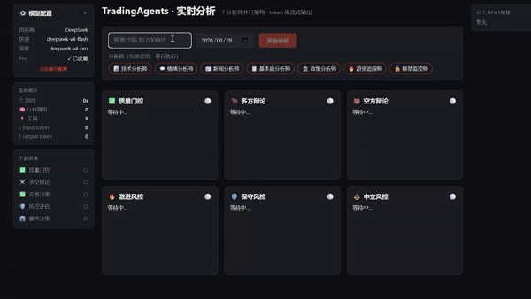
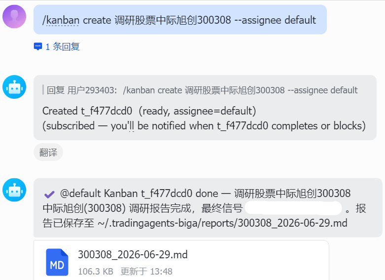
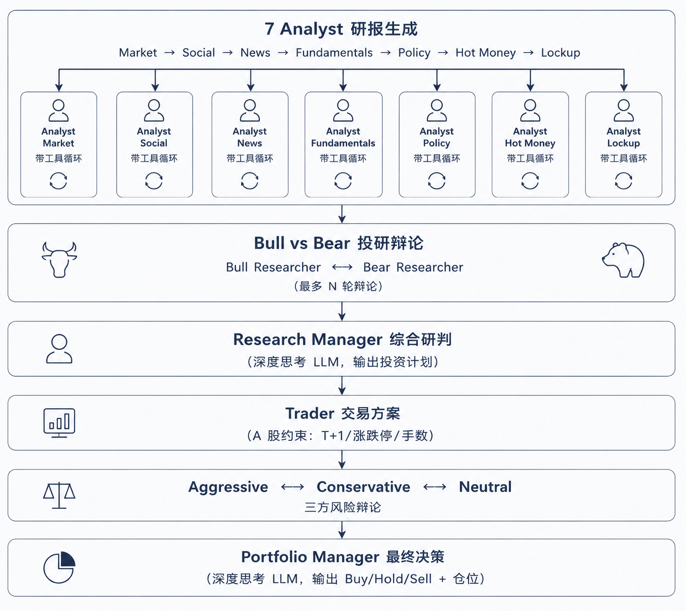

<h1 align="center">TradingAgents-BigA</h1>

<p align="center">
  基于 <a href="https://github.com/TauricResearch/TradingAgents">TauricResearch/TradingAgents</a>（89.3K ⭐）和 <a href="https://github.com/simonlin1212/TradingAgents-astock">simonlin1212/TradingAgents-astock</a>（1.5K ⭐）<br>
  全 Apache 2.0 开源
</p>

<p align="center">
  <b>⚠️ 免责声明：本项目仅供学习研究与技术演示，不构成任何投资建议。投资决策请咨询持牌专业机构。</b>
</p>

<p align="center">
  <a href="https://github.com/villain3380/TradingAgents-BigA/stargazers"></a>
  <a href="https://github.com/villain3380/TradingAgents-BigA/network/members"></a>
  <a href="https://arxiv.org/abs/2412.20138"></a>
  <a href="./LICENSE"></a>
  <a href="./CHANGES_FROM_UPSTREAM.md"></a>
</p>

---

<p align="center">
  
</p>

⚡ 7 大分析师并行分析 · SSE 流式输出 · 数据源免费 · A 股适配 · 展示检索链接点击直达新闻来源

## 目录

- [目录](#目录)
- [快速开始](#快速开始)
  - [环境准备](#环境准备)
  - [启动](#启动)
- [接入Hermes](#接入hermes)
  - [更建议用kanban](#更建议用kanban)
- [架构概览](#架构概览)
- [7 个 Analyst 角色（A 股适配）](#7-个-analyst-角色a-股适配)
- [数据源](#数据源)
- [项目结构](#项目结构)
- [致谢](#致谢)
- [许可证](#许可证)
- [免责声明](#免责声明)

---

## 快速开始

### 环境准备

```bash
git clone https://github.com/villain3380/TradingAgents-BigA.git
cd TradingAgents-BigA
pip install -e .
```

```bash
cd frontend && npm install
```

### 启动

```bash
tradingagents-web
```

```bash
cd frontend && npm run dev
```

不用配置.env，准备好你的大模型服务商的base_url和你的api_key，直接打开网页，在左侧配置栏填写，再输入感兴趣的股票代码，如：300308，即可开始分析

---

## 接入Hermes

在 `~/.hermes/skills` 新建 `tradingagents-biga` 文件夹，把本项目 `skill` 文件夹里面的文件粘贴进刚刚创建的 `~/.hermes/skills/tradingagents-biga` 文件夹

启动 Hermes，让它使用 tradingagents-biga 技能分析某个股票，5~8 分钟后调研结束 Hermes 收到调研报告路径会自己读取并总结向你汇报

### 更建议用kanban

直接给 Hermes 发：`/kanban create 调研股票中际旭创300308 --assignee default`，让 Hermes 使用 Hermes kanban 功能，将调研任务创建为 kanban 任务，不影响当前对话，任务完成会收到通知，命令行输入 `hermes dashboard` 在左侧栏往下滚动找到 kanban 可查看任务状态

<p align="center">
  
</p>

---

## 架构概览

<p align="center">
  
</p>

**双 LLM 设计**：
- `quick_think_llm`：所有 Analyst、Researcher、Trader、Risk Debater
- `deep_think_llm`：Research Manager 和 Portfolio Manager（需要综合全局信息做决策）

---

## 7 个 Analyst 角色（A 股适配）

| 角色 | 职责 | 数据工具 |
|------|------|---------|
| 🏪 市场分析师 | K 线形态、技术指标、量价分析 | `get_stock_data`, `get_indicators` |
| 💬 舆情分析师 | 社交媒体情绪、散户讨论热度 | `get_news` |
| 📰 新闻分析师 | 行业新闻、公告、宏观事件 | `get_news`, `get_global_news`, `get_insider_transactions` |
| 📊 基本面分析师 | 财报三表、盈利能力、估值 | `get_fundamentals`, `get_balance_sheet`, `get_cashflow`, `get_income_statement` |
| 🏛️ 政策分析师 | 监管政策、产业政策、窗口指导   | `get_news`, `get_global_news`                              |
| 🔥 游资追踪师  | 龙虎榜、大单流向、主力资金动态  | `get_stock_data`, `get_news`, `get_insider_transactions`   |
| 🔓 解禁监控师  | 限售股解禁、大股东减持、股权质押 | `get_insider_transactions`, `get_news`, `get_fundamentals` |

所有 7 个 Analyst 的报告会流入后续的 Bull/Bear 辩论和三方风险辩论，确保 A 股特色因素贯穿整条决策链。

---

## 数据源

全部免费，无需 API Key：

| 来源 | 协议 | 提供内容 |
|------|------|---------|
| **mootdx** | TCP 7709 | OHLCV K 线、财务快照、F10 文本 |
| **腾讯财经** | HTTP (`qt.gtimg.cn`) | PE / PB / 市值 / 换手率（实时） |
| **东方财富** | HTTP (datacenter / push2) | 龙虎榜、限售解禁、板块行情、个股信息 |
| **新浪财经** | HTTP | K 线历史、财报三表 |
| **同花顺** | HTTP (10jqka) | EPS 一致预期 |
| **财联社** | HTTP (cls.cn) | 全球财经快讯 |
| **百度股市通** | HTTP (finance.pae.baidu) | 概念板块分类、资金流向 |

> **数据源优先级 & 东财防封（v0.2.11）**：行情 / K线 / 市值 / 财务能从 mootdx（通达信 TCP，不封 IP）或腾讯拿到的，一律走它们；东财只用于它独有的数据（龙虎榜 / 解禁 / 资金流 / 板块 / 个股新闻等）。所有东财请求统一走内置节流入口 `_em_get()`：串行限流（默认间隔 ≥1s + 0.1~0.5s 随机抖动）+ 复用 Keep-Alive 会话，多 Agent 跑批量分析不再触发临时封 IP（东财风控实测：每秒 >5 / 并发 ≥10 / 1 分钟 ≥200 触发封禁）。批量场景可设环境变量 `EM_MIN_INTERVAL=1.5~2` 进一步降速。**仅东财限流，mootdx / 腾讯 / 新浪 / 同花顺 / 财联社 / 百度 不受影响。**

---

## 项目结构

```
TradingAgents-BigA/
├── tradingagents/
│   ├── agents/          # 7 分析师 + Bull/Bear + 风控 + Manager + Trader
│   ├── dataflows/       # A 股数据源（mootdx/腾讯/东财/新浪/同花顺/财联社/百度）
│   ├── graph/           # LangGraph 编排（并行 Fan-out + 条件路由）
│   └── llm_clients/     # 多供应商 LLM 适配
├── web/api/             # FastAPI + SSE 流式后端
├── frontend/            # React + Vite 前端（token 级流式 UI）
├── cli/                 # 交互式命令行（tradingagents-cli）
├── tests/               # pytest 测试套件
└── pyproject.toml       # 包定义与依赖
```

---

## 致谢

本项目基于 [TauricResearch/TradingAgents](https://github.com/TauricResearch/TradingAgents) 和 [simonlin1212/TradingAgents-astock](https://github.com/simonlin1212/TradingAgents-astock) 开源项目进行改造。感谢原作者们的出色工作和 Apache 2.0 开源精神。

**原始论文**：[TradingAgents: Multi-Agents LLM Financial Trading Framework](https://arxiv.org/abs/2412.20138)

---

## 许可证

[Apache License 2.0](./LICENSE)

继承 Apache 2.0 许可证

---

## 免责声明

> **本项目仅供学习研究与技术演示，不构成任何投资建议。**
>
> - 本系统产出的所有分析报告和交易信号均由 AI 自动生成，可能存在错误或偏差
> - 投资决策请咨询持有中国证监会颁发资质的专业机构
> - 作者不对使用本工具产生的任何投资损失承担责任
> - 股市有风险，投资需谨慎
